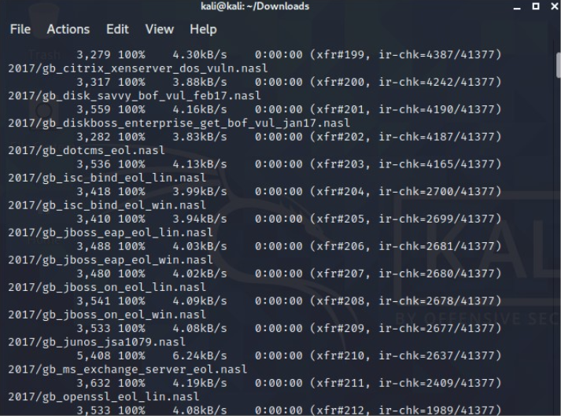
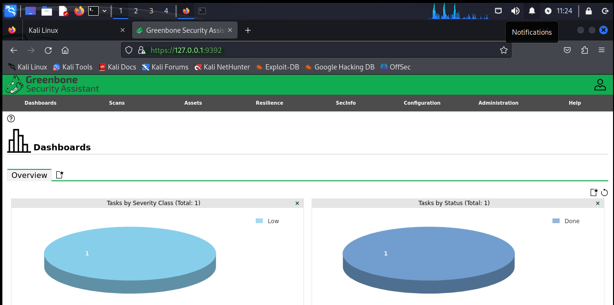

# Instalación de OpenVas

En esta entrada, vamos a ver como podemos instalar OpenVas. OpenVAS (Open Vulnerability Assessment System) es una plataforma de escaneo de vulnerabilidades de código abierto diseñada para ayudar en la detección y gestión de vulnerabilidades en sistemas informáticos. OpenVAS es una alternativa gratuita a otras herramientas comerciales de escaneo de vulnerabilidades.

## 1. Actualizar la paqueteria e instalar paquetes necesarios

El primer paso, como en la mayoría de instalaciones, será actualizar la paquetería del sistemas para contar con las últimas versiones de los paquetes. Esto lo haremos ejecutando un:

`sudo apt update && sudo apt upgrade`

Una vez hecho esto, podremos instalar gvm y ufw:

`sudo apt install gvm`
`sudo apt install ufw`

## 2. Configuración de OpenVas

Posteriormente a estas instalaciones, podremos comenzar con la configuración de OpenVas, en primer lugar ejecutaremos un `sudo gvm-setup`, esto iniciará la descarga de todas las firmas que utiliza OpenVas para el escaneo de vulnerabilidades:

## 3. Habilitar los puertos y permitir acceso

Cuando el proceso anterior haya terminado podremos pasar al siguiente paso, el cual se trata de habilitar los puertos que usará OpenVas para el acceso. Para esto ejecutaremos los comandos:

* `sudo ufw enable`
* `sudo ufw allow 80`
* `sudo ufw allow 9392`

## 4. Instalar el asistente GreenBone y acceder a la interfaz

Instalaremos **Greenbone**, el asistente gráfico de OpenVas.

`sudo apt-get install -y greenbone-security-assistant`

Una vez terminada la instalación confirmamos que GreenBone esta configurado y listo para usarse. Para ello podemos emplear el comando `gvm-check-setup`

Para acceder a OpenVas nos dirigiremos a nuestro navegador y escribiremos ***https://localhost:9392***. Aquí escribiremos el usuario y la contraseña generados durante la configuración de gvm y finalmente tendremos acceso.

Con esto sería todo, espero que esta documentación le haya sido de ayuda. 